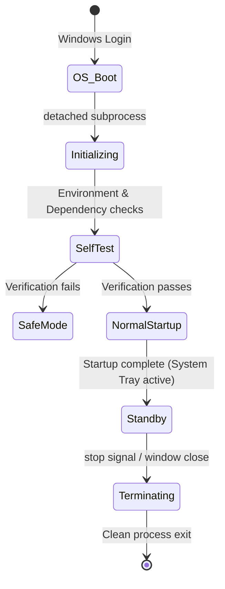
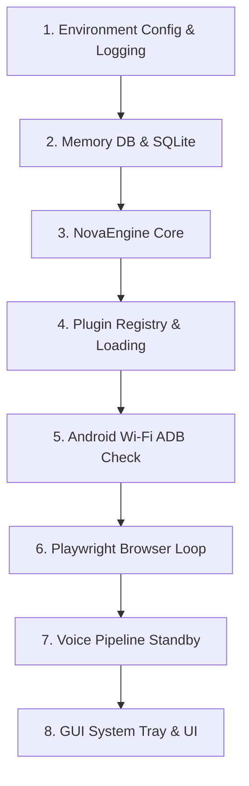

# 🚀 Nova Startup Manager: Design Specification

This document details the startup mechanics, lifecycle phases, dependency graphs, and failure recovery protocols of the Nova AI Assistant from host system boot to interactive standby.

---

## 1. Boot Lifecycle on Windows

Nova auto-starts on Windows login using a registry run entry. The configuration is managed at:
`HKCU\Software\Microsoft\Windows\CurrentVersion\Run`

- **Startup Execution**: Launches the Python process silently inside a detached shell:
  `pythonw.exe c:\Users\asus\OneDrive\Desktop\nova\main.py --gui --minimized`
- **Window State**: Resolves to minimized-to-tray mode, keeping startup visual noise at zero while initializing background loops.

---

## 2. Background Service Lifecycle

---

## 3. Detailed Startup Sequence

1. **Host Boot**: OS triggers shortcut link or registry key.
2. **Environment Discovery**: Reads `.env` and checks paths for dependencies (`adb.exe`, Python venv).
3. **Core Assembly**: Instantiates `ShortTermMemory` and `NovaEngine`.
4. **Tool Registry Binding**: Dynamically imports and instantiates plugin modules.
5. **Auto-Reconnection**: Reconnects to the last saved wireless ADB device via a 5-second background subprocess.
6. **Thread Pools**: Starts the Playwright browser loops and the `VoiceManager` listener loop.
7. **Tray Registration**: Registers UI and tray icons in the Windows Shell API.
8. **Standby**: Enters wake word monitoring state.

---

## 4. System Tray Behavior

The tray icon is the primary control point when running minimized:
- **Idle State**: Solid gray/blue icon (monitoring for wake words).
- **Listening State**: Pulsing green icon (processing voice commands).
- **Offline / Error State**: Warning yellow/red icon (missing keys or network connectivity).
- **ContextMenu Options**:
  - Open Dashboard (brings GUI to focus)
  - Toggle Voice Input (enables/disables microphone monitoring)
  - Toggle Wake Word (disables wake word, switches to manual push-to-talk)
  - View System Logs (opens `logs/nova.log`)
  - Exit Nova (terminates background threads and shuts down process)

---

## 5. Subsystem Initialization Order

To guarantee stable dependency bindings, subsystems are loaded sequentially:

---

## 6. Subsystem Initialization Details

### A. Voice Subsystem
- Verifies system audio input hardware (SoundCard detection).
- Configures default sample rates, channel numbers, and VAD thresholds.
- Loads STT models (FasterWhisper tiny/base weights) in CPU memory.
- Fires the background listener thread and transitions to `WAKING` state.

### B. LLM Subsystem
- Reads and validates `GEMINI_API_KEY` from the environment.
- Tests connection with the routing provider.
- If checks fail or keys are absent, falls back to `EchoSkill` offline mode and logs a warning.

### C. Plugin Subsystem
- Scans `plugins/` directory.
- Dynamically imports custom subclass plugins.
- Instantiates plugins and appends them to the engine registries.
- Runs individual `initialize_plugin()` scripts.

### D. Android Subsystem
- Verifies that ADB is installed in the system PATH.
- Runs `adb devices` asynchronously.
- Connects to the last saved IP in `data/android_config.json` if no USB connection is active.
- Exits connection hooks gracefully after a 5-second timeout if unsuccessful.

### E. Browser Subsystem
- Launches a Playwright manager instance.
- Boots a dedicated thread running its own asyncio loop to isolate Playwright context calls.
- Pre-warms the browser session using cached profile cookies.

### F. Memory Subsystem
- Verifies local schema definitions in `data/long_term_memory.db`.
- Migrates legacy JSON facts to the SQLite database.
- Pre-warms cache memory with recent conversational logs.

---

## 7. Failure Recovery & Safe Mode

### Failure Matrix
* **Audio Input Missing**: Fall back to text-only mode, register warning icon in system tray, and continue.
* **LLM API Timeout**: Retry up to 3 times, then fall back to local offline skills (Calculator, Help, Echo) and speak a connection failure alert.
* **ADB Disconnection**: Fail silently during startup reconnects, logging the error and leaving the Android tool in offline mode.
* **Playwright Crash**: Terminate browser agent thread, reset state, and launch a fresh thread upon the next browser request.

### Safe Mode
If Nova crashes 3 consecutive times during startup (within 30 seconds of launch), the boot manager automatically launches in **Safe Mode**:
- Skips loading external plugins.
- Disables voice microphone threads.
- Runs strictly in offline text-only console mode.
- Opens the system dashboard showing logs to diagnose issues.

---

## 8. State Transitions on Shutdown & Restart

### Shutdown Sequence
1. User clicks "Exit" or triggers process termination.
2. Shell triggers `engine.shutdown()`.
3. Sets `_stop_event` flag across active threads.
4. Voice loops drop recorder instances and exit.
5. Playwright close calls are run, and the browser loop thread joins.
6. DB connections flush write queues and close.
7. Temporary wave assets are unlinked from disk.
8. Process exits cleanly.

### Restart Sequence
1. Sets `_stop_event` flag to terminate running threads.
2. Clears existing tool registrations.
3. Reloads environment parameters from `.env`.
4. Triggers the startup sequence from step 3.

---

## 9. Performance & Extensibility Targets

- **Total Startup Time**: Under 3 seconds to reach system tray initialization.
- **Voice Loop Activation**: Background voice thread active and listening within 1.5 seconds.
- **Subprocess Isolation**: Process startups (like ADB or Playwright) must run asynchronously or behind strict 5-second timeouts.
- **Extensible Hooks**: Developers can hook into startup and shutdown states by implementing `on_startup()` and `on_shutdown()` methods inside custom plugin files.

---

Architecture Status:
LOCKED
